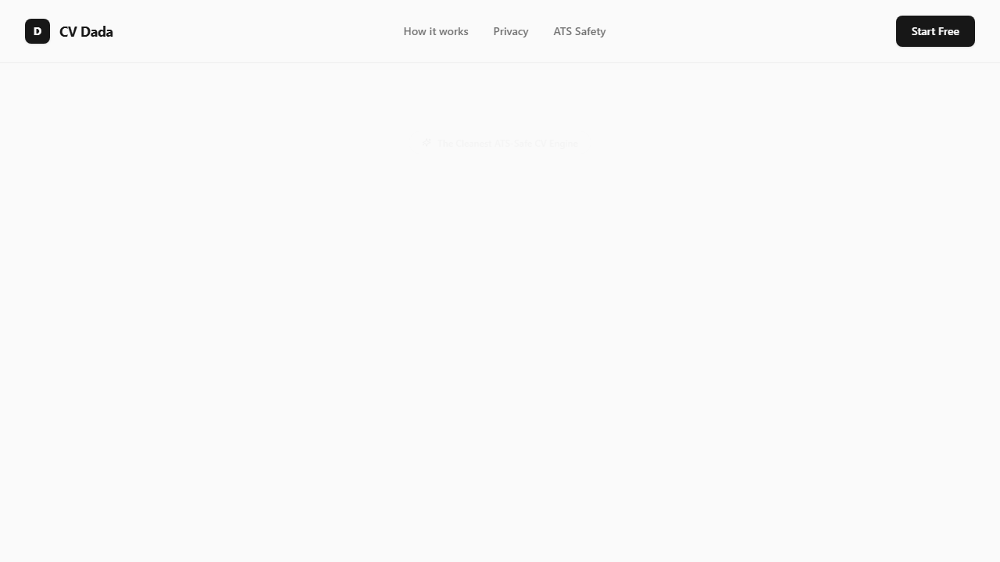
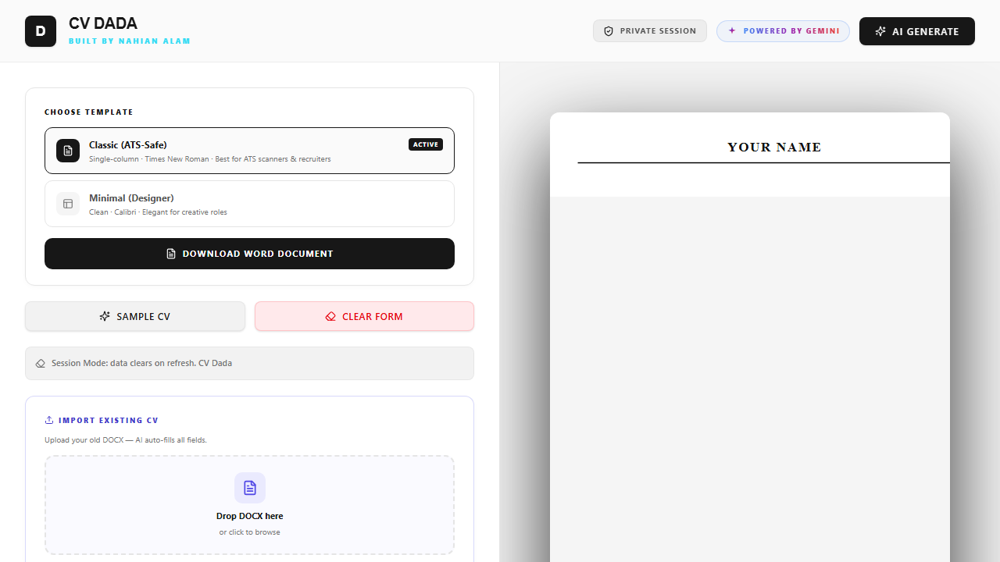

# CV Dada v3.0




Live: gemini-cv-dada-v3.vercel.app

A fast, private, and smart CV builder. No accounts, no database, no tracking.

Built by Nahian Alam

---

## Overview

CV Dada helps you build a clean, ATS-friendly resume in minutes. You can fill out the form manually, generate a complete CV using AI by providing a short description, or upload an existing DOCX resume to auto-fill the fields. 

Everything runs locally in your browser session. When you close the tab, your data is gone forever.

---

## What's New in v3.0

- A completely redesigned Minimal Light interface
- Upgraded to Gemini 3.8 Flash for smarter CV generation
- Extremely reliable local DOCX parsing (PDF support removed for stability)
- Instant prompt starters for role-specific CV generation
- Quick actions to load sample CVs or clear forms instantly
- Improved DOCX exporting system

---

## Features

- Two templates: Classic (Times New Roman, ATS-optimized) and Minimal (Calibri, clean and modern)
- AI generation: Build a full CV from a short text description
- Smart parsing: Upload a DOCX resume and auto-fill the form instantly
- ATS score checker: Paste a job description to see your match score and missing keywords
- AI field improvement: Rewrite any section to sound more professional
- Photo support: Upload and embed a passport-style photo directly in your CV
- Zero storage: No database, no accounts, no analytics

---

## Tech Stack

| Layer       | Tool                                      |
| ----------- | ------------------------------------------ |
| Framework   | Next.js 16, React 19                       |
| Styling     | Tailwind CSS v4                            |
| Language    | TypeScript                                 |
| Animations  | Framer Motion v12                          |
| Word export | docx v9.6.1                                |
| DOCX import | jszip                                      |
| AI          | Google Gemini 3.8 Flash (via OpenRouter)   |

---

## Getting Started

```bash
git clone https://github.com/alamnahianofficial/CV-Dada-v3.0-CV-Ai-CV-maker.git
cd CV-Dada-v3.0-CV-Ai-CV-maker
npm install
```

Create a `.env.local` file in the project root:

```env
OPENROUTER_API_KEY=your_openrouter_api_key_here
NEXT_PUBLIC_SITE_URL=http://localhost:3000
```

Get a free API key at openrouter.ai

Run the app:

```bash
npm run dev
```

Open http://localhost:3000

---

## Project Structure

src/
  app/
    page.tsx                  # Landing page
    builder/page.tsx          # Builder UI
    api/ai/route.ts           # AI route (generate, improve, parse)
  components/
    StandardCV.tsx            # CV preview components
    builder/                  # Form sections, AI modal, ATS checker
  lib/
    aiHelpers.ts
    atsCalculator.ts
    docxExport.ts
    resumeDefaults.ts
  types/
    resume.ts

---

## Privacy Policy

No database. No accounts. No tracking. All CV data lives entirely in React state and is completely cleared the moment you refresh or close the tab. The AI only sees the specific text you submit for generation or improvement.
